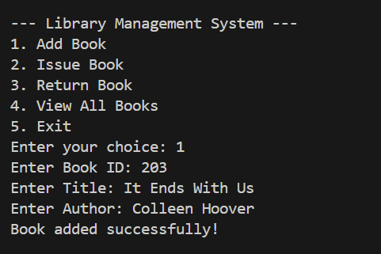

# 📚 Library Management System (Java Console App)

This is a simple **Library Management System** built using **Java**. It allows users to **add**, **issue**, **return**, and **view** books. The data is stored in a file using Java's object serialization.

---

## 🚀 Features

- ✅ Add new books
- ✅ Issue a book
- ✅ Return a book
- ✅ View all available and issued books
- ✅ Data persistence using file serialization (`library_data.ser`)

---

## 📁 Project Structure

